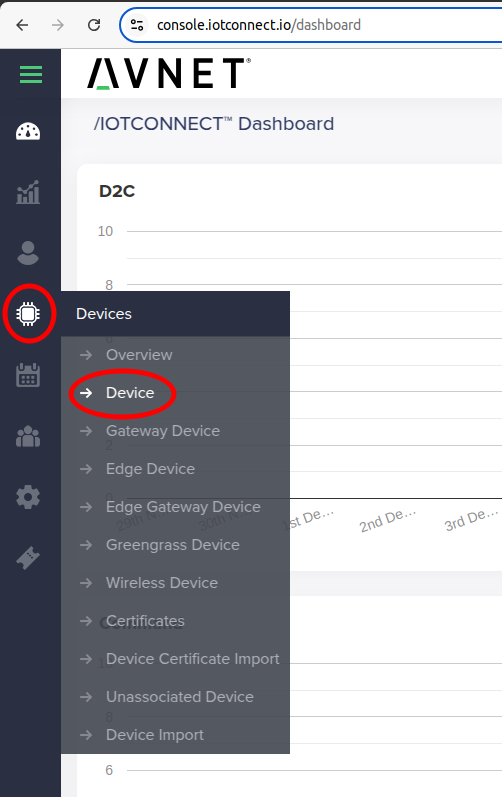
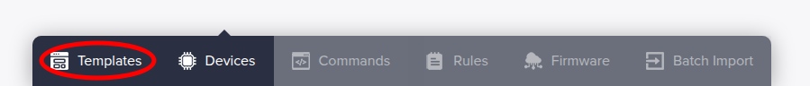
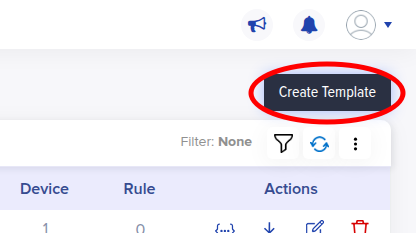
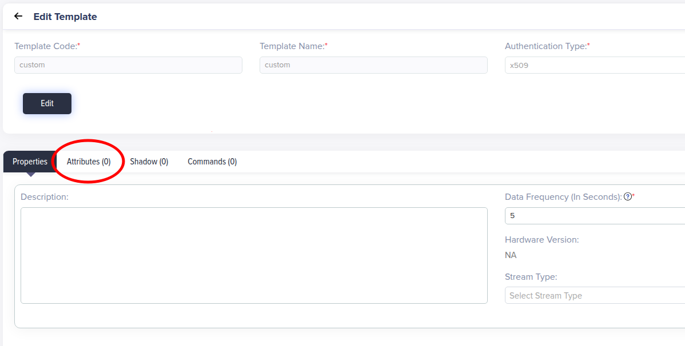
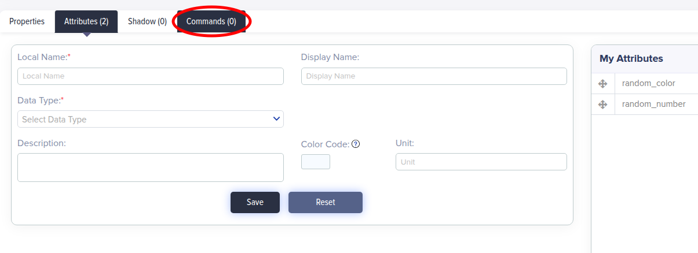
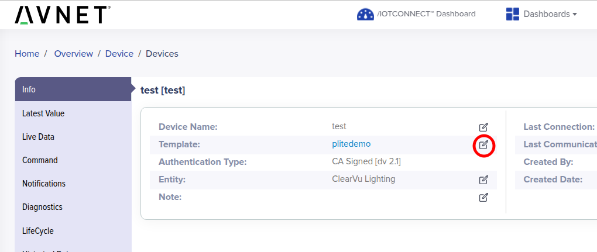

# /IOTCONNECT Relay Service Guide

1. [Introduction](#1-introduction)
2. [Device Setup](#2-device-setup)
3. [Add the Relay Python App to Your Device](#3-add-the-relay-python-app-to-your-device)
4. [Modifications to User Applications](#4-modifications-to-user-applications)
5. [Update Device Template](#5-update-device-template)
6. [Set Up the /IOTCONNECT Relay Service](#6-set-up-the-iotconnect-relay-service)
7. [Using the /IOTCONNECT Relay Service with User Applications](#7-using-the-iotconnect-relay-service-with-user-applications)
8. [Resources](#8-resources)

# 1. Introduction

This guide will walk you through how to enable the /IOTCONNECT Relay Service on a supported device 
to transmit and receive data to/from any type of customer process via Unix socket. This allows any user 
to report data from their existing applications to /IOTCONNECT and receive cloud commands from /IOTCONNECT 
while mkaing minimal modifications.

This guide also includes a working example Python application (to resemble a user application) and detailed 
instructions on the necessary modifications connect it to the /IOTCONNECT service to enable telemetry reporting 
and cloud-command handling.

> [!NOTE]
> Your application *does not need to be written in Python* to be compatible with the Relay service. It can
> be in **any language** you need it to be as long as it can read/write a local JSON file. The example given in this guide
> is in Python simply because it is one of the most common languages used.

After following this guide you should be able to connect your own custom application to /IOTCONNECT with ease!

# 2. Device Setup

In the Quickstart guide for your supported board in the [/IOTCONNECT Python Lite Demos repo](https://github.com/avnet-iotconnect/iotc-python-lite-sdk-demos/tree/main), 
follow each of the steps until you reach the "Using the Demo" step. 

This will walk users through how to set up hardware, configure the software, and onboard a device into /IOTCONNECT.

> [!NOTE]
>  Since these steps can differ board-to-board it is important to look at the Quickstart **for your specific device.**

# 3. Add the /IOTCONNECT Relay Server and Client Code to Your Device

Download the /IOTCONNECT Relay Server application and Client module using these commands in the console:

```
wget -O /home/weston/demo/iotc-relay-server.py https://raw.githubusercontent.com/avnet-iotconnect/iotconnect-relay-service/main/relay-server/iotc-relay-server.py
wget -O /home/weston/demo/iotc_relay_client.py https://raw.githubusercontent.com/avnet-iotconnect/iotconnect-relay-service/main/client-module/iotc_relay_client.py
```
> [!NOTE]
> You can download these to a different directory but **ensure that you update the locations of these files in all
> other references to them.**

# 4. Modifications to User Applications

> [!NOTE]
> For your convenience, if you just wish to test out the Relay functionality you can download a ready-to-use
> example custom client application with this command:
> ```
> wget https://raw.githubusercontent.com/avnet-iotconnect/iotconnect-relay-service/refs/heads/main/client-examples/client-example-0.py
> ```
> If you wish to test with multiple client applications running at once, you can download a similar second ready-to-use
> example client (generates negative numbers and random weather-descriptive strings) with this command:
> ```
> wget https://raw.githubusercontent.com/avnet-iotconnect/iotconnect-relay-service/refs/heads/main/client-examples/client-example-1.py
> ```
> Step 4 walks you through how to create client-example-0.py yourself, so if you downloaded it you can skip to [Step 5](#5-update-device-template).

Here is a basic Python script that can represent an existing user application:

```
import time
import random
import sys

COLORS = ["red", "blue", "green", "yellow", "orange", "purple", "black", "white"]


def generate_random_data():
    random_int = random.randint(0, 100)
    random_color = random.choice(COLORS)
    return random_int, random_color


def main():
    try:
        while True:
            number, color = generate_random_data()
            print(f"Number: {number}, Color: {color}")
            time.sleep(5)

    except KeyboardInterrupt:
        print("Exiting...")
        sys.exit(0)


if __name__ == "__main__":
    main()
```

The first addition users need to make is importing the iotc_relay_client 
module (from the location it was downloaded to), and then adding basic socket config:

```
# Add location of relay client module to path
CLIENT_MODULE_PATH = "/home/weston/demo" 
sys.path.insert(0, CLIENT_MODULE_PATH)

from iotc_relay_client import IoTConnectRelayClient

SOCKET_PATH = "/tmp/iotconnect-relay.sock"
CLIENT_ID = "random_data_generator"
```

The next addition is going to be a handler function for acting upon the received cloud commands from the server. A basic version 
of this could be:

```
def handle_cloud_command(command_name, command_parameters): 
    print(f"Command received: {command_name}")
    
    if command_name == "Command_A":
        print(f"Executing protocol for Command_A with parameters: {command_parameters}")
    elif command_name == "Command_B":
        print(f"Executing protocol for Command_B with parameters: {command_parameters}")
    else:
        print(f"Command not recognized: {command_name}")

```
> [!TIP]
> The cloud command handler should always expect to receive a string "command_name" (basic command name called) and a string
> "command_parameters" (space-separated parameters).

The final modifications are going to be in the main loop of the application to initialize connection and then utilize the socket:

```
def main():
    # Initialize and start client
    client = IoTConnectRelayClient(
        socket_path=SOCKET_PATH,
        client_id=CLIENT_ID,
        command_callback=handle_cloud_command
    )
    client.start()
    
    try:
        while True:
            number, color = generate_random_data()
            print(f"Number: {number}, Color: {color}")
            
            # Send telemetry if connected
            if client.is_connected():
                client.send_telemetry({"random_number": number, "random_color": color})
            
            time.sleep(5)
    
    except KeyboardInterrupt:
        print("\nExiting gracefully...")
        client.stop()
        sys.exit(0)
```

Altogether, the /IOTCONNECT Relay-compatible version of the example script would be:

```
import time
import random
import sys

# Add location of relay client module to path
CLIENT_MODULE_PATH = "/home/weston/demo" 
sys.path.insert(0, CLIENT_MODULE_PATH)

from iotc_relay_client import IoTConnectRelayClient

SOCKET_PATH = "/tmp/iotconnect-relay.sock"
CLIENT_ID = "random_data_generator"

COLORS = ["red", "blue", "green", "yellow", "orange", "purple", "black", "white"]

def handle_cloud_command(command_name, command_parameters): 
    print(f"Command received: {command_name}")
    
    if command_name == "Command_A":
        print(f"Executing protocol for Command_A with parameters: {command_parameters}")
    elif command_name == "Command_B":
        print(f"Executing protocol for Command_B with parameters: {command_parameters}")
    else:
        print(f"Command not recognized: {command_name}")


def generate_random_data():
    return random.randint(0, 100), random.choice(COLORS)


def main():
    # Initialize and start client
    client = IoTConnectRelayClient(
        socket_path=SOCKET_PATH,
        client_id=CLIENT_ID,
        command_callback=handle_cloud_command
    )
    client.start()
    
    try:
        while True:
            number, color = generate_random_data()
            print(f"Number: {number}, Color: {color}")
            
            # Send telemetry if connected
            if client.is_connected():
                client.send_telemetry({"random_number": number, "random_color": color})
            
            time.sleep(5)
    
    except KeyboardInterrupt:
        print("\nExiting gracefully...")
        client.stop()
        sys.exit(0)


if __name__ == "__main__":
    main()
```

> [!IMPORTANT]
> If you are using multiple clients on your device to report data to the server, **ensure that they do not use the same
> data variable names as each other.** Some of the data could be overwritten and lost.

# 5. Update Device Template

For /IOTCONNECT to recognize the data attributes you report and send commands to your device, the template for your device 
will need to be updated.

To create a new template, log into your /IOTCONNECT account at https://console.iotconnect.io/login and then in the blue 
vertical toolbar on the left side of the page, hover over the processor icon and then click "Device" in the resulting dropdown.



Now in the Devices page, in the blue horizontal toolbar at the bottom of the screen click on the "Templates" button.



In the Templates page, click on the blue "Create Template" button in the top-right corner.



Fill in the Template Code and Template Name fields with your desired alpha-numeric values (must start with a letter), and leave the 
Authentication Type and Device Message Version on their default values. Then click "Save".

> [!TIP]
> For simplicity we recommend making the Template Code and Template Name the same values.

In the resulting page, you can add your data attributes, cloud commands, and adjust your data frequency.

If your Data Frequency is not set to 5 by default, it is recommended to change it to 5 since that is the frequency that the Handoff 
application expects by default.

> [!NOTE]
> If the /IOTCONNECT UI says you cannot set the Data Frequency as low as you would like, submit a support ticket (bottom of the vertical
> toolbar on the left edge of the page) requesting the value be changed to 5 for that template.

To add Attributes (data fields) to your template, click on the "Attributes" tab.



Populate the "Local Name" with the exact key name you used for that data field to send it to the Relay server. For the example script from above,
the Local Names for the 2 attributes would be `random_color` and `random_number`.

> [!NOTE]
> If using client-example-1.py in addition to client-example-0.py, add `random_weather` and `random_number_neg` to the template attributes as well.

Use the "Data Type" dropdown and select the type that matches the data being reported. For the example script from above,
the Data Type for `random_color` would be STRING and the Data Type for `random_number` would be INTEGER.

> [!TIP]
> For any non-whole number data (not including GPS coordinates, use LATLONG for those), it is recommended that the DECIMAL data type be used.

If you are reporting data objects, you can use the OBJECT data type and then add member-attributes of specific types within that object. 

> [!IMPORTANT]
> Ensure that the Local Names are **identical** to the key names used for sending the data to the Relay server, as no modifications to the data
> are made by the Relay server.

After an attribute is configured, click the "Save" button to add it to the template.

To add Cloud Commands, click on the "Commands" tab.



Fill in the "Command Name" and "Command" fields with the values your command handler 
expects to receive for the "command_name" key.

> [!NOTE]
> For simplicity, populate the "Command Name" and "Command" fields with the same values.

If the nature of your command would require a parameter, toggle the "Parameter Required" 
switch to the "ON" position. This will prevent a user from accidentally sending a command 
without a necessary parameter.

Toggle the "Receipt Required" switch to the "ON" position for all commands you add, since 
the /IOTCONNECT Relay application is programmed to send an acknowledgement back to cloud 
whenever a command is received.

For the example script from above, you would enter `Command_A` for both fields for the first 
command and then `Command_B` for both fields for the second command. The "Parameter Required" 
switch can be left OFF but the "Receipt Required" should be turned ON.

After a command is configured, click the "Save" button to add it to the template.

Once all desired attributes and commands have been added, navigate back to the "Device" page 
of /IOTCONNECT and then click on your specific device name to be taken to your device's page.

In your device's page, click on the pen-and-paper icon next to the "Template" selection.



In the resulting drop-down, select the name of the new template you just created and that new 
template will instantly be assigned to your device.

# 6. Set Up the /IOTCONNECT Relay Service to Run on Boot

To have the iotc-relay-server.py run on boot in the background as a service, first users need to 
create a service file called `iotconnect-relay.service` in the directory `/etc/systemd/system/`.

Here is an example service file that will work on Linux devices with a `weston` user and have 
`iotc-relay-server.py` in the `/home/weston/demo` directory:

> [!NOTE]
> Directly download this service file to the correct directory of your device by executing this command:
> ```sudo wget -O /etc/systemd/system/iotconnect-relay.service https://raw.githubusercontent.com/avnet-iotconnect/iotconnect-relay-service/main/service-file/iotconnect-relay.service```

```
[Unit]
Description=IoTConnect Relay Server
After=network.target

[Service]
Type=simple
User=weston
WorkingDirectory=/home/weston/demo
ExecStart=/usr/bin/python3 /home/weston/demo/iotc-relay-server.py
Restart=on-failure
RestartSec=10
StandardOutput=journal
StandardError=journal

# Environment variables (if needed)
Environment="PYTHONUNBUFFERED=1"

[Install]
WantedBy=multi-user.target
```
> [!IMPORTANT]
> Make sure to modify the `User` field to a valid non-root user on your device, and to modify the
> working directory and exec start fields to the directory where iotc-relay-server.py is located
> on your device.

> [!TIP]
> It is recommended to not use `root` as the user for the service to avoid any permissions errors
> in the socket system when running a client as a non-root user.

After the service file has been written, execute these commands to enable and start the service:

```
sudo systemctl daemon-reload
sudo systemctl enable iotconnect-relay.service
sudo systemctl start iotconnect-relay.service
```

> [!TIP]
> Here are some console commands that can be useful for manaing, debugging, and monitoring the /IOTCONNECT
> Relay Service:
> 
> Check if the service is running
> ```sudo systemctl status iotconnect-relay.service```
>
> View live logs
> ```sudo journalctl -u iotconnect-relay.service -f```
>
> View recent logs
> ```sudo journalctl -u iotconnect-relay.service -n 50```
> 
> Stop the service
> ```sudo systemctl stop iotconnect-relay.service```
>
> Restart the service
> ```sudo systemctl restart iotconnect-relay.service```
>
> Disable auto-start on boot
> ```sudo systemctl disable iotconnect-relay.service```
> 
> View all logs
> ```sudo journalctl -u iotconnect-relay.service```
>
> Clear old logs
> ```sudo journalctl --vacuum-time=7d```


# 7. Using the /IOTCONNECT Relay Service with User Applications

After the Relay Service has been enabled and started, all that users need to do is run their 
(modified) application(s) as they normally would. Data from the application(s) will be sent to the server 
and transmitted to /IOTCONNECT at the data frequency specified in `iotc-relay-server.py`.

> [!NOTE]
> If a user needs to change the data frequency of the server, they can do so by modifying the `DATA_FREQUENCY` value in line
> 18 of the `iotc-relay-server.py`. If the desired data frequency is lower than the value in the /IOTCONNECT device template, the value in the
> template must first be lowered. *If the template-editing page shows an alert saying that the desired data frequency is too low, please
> submit a [support ticket](https://docs.iotconnect.io/iotconnect/user-manuals/support-tickets/) in /IOTCONNECT asking
> for the data frequency of your template to be changed.*

Commands sent from /IOTCONNECT will be transmitted from the server to the client app(s) to be handled 
by the newly-added `handle_cloud_command` function.

Users can conveniently view live telemetry data ("Live Data" tab) and send device commands ("Command" tab) from their device's page in 
the /IOTCONNECT online UI.

# 8. Resources
* To see the setup and onboarding guide for specific boards check out [the /IOTCONNECT Python Lite SDK Demos repo](https://github.com/avnet-iotconnect/iotc-python-lite-sdk-demos/tree/main)
* [/IOTCONNECT Python Lite SDK](https://github.com/avnet-iotconnect/iotc-python-lite-sdk)
* [/IOTCONNECT Overview](https://www.iotconnect.io/)
* [/IOTCONNECT Knowledgebase](https://help.iotconnect.io/)
